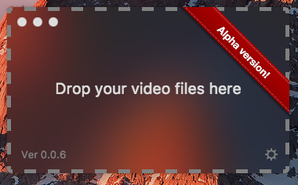

<h1 align="center">
  
  <br>
  SubtiTron
  <br>
  <br>
</h1>

<p align="center">
<a href='https://ko-fi.com/A838QJC' target='_blank'></a>
  <a href="http://standardjs.com"></a>
  <a href="https://www.npmjs.com/package/standard"></a>
</p>

### What is it?

App based on Electron to **download subtitle** files from *Opensubtitles*.

**NOTE:** This is a **initial alpha release** 0.0.x. It works only with tv shows and not very accuracy.

### Features/Goals

Drop video files to get subtitles in the default language of your operating system.

You can donate some money to me if you want. Click on icon *Buy Me a Coffee* below. Thank you!.

### Install and use

```
npm i
npm start
```

### TODO

* ~~Improve logic to download subtitles.~~

* ~~Settings pane.~~

* Translate the app to others languages. Only spanish and english (the last one is the default language).

* Pass video files as arguments to the app.

* Drag folder(s) too.

### Notes

* Only tested on *macOS Sierra*.

### Some ideas to the future of the app

* Download subtitles from *tusubtitulo.com*.

* Open dialog to load video files.

* Auto-update app when new release is ready.

* Save subtitles in another folder if movie file is in a only read storage device.

* Drag an entire folder to search all movie/tvshow subtitles inside it.

* Petitions are welcome.

### Interesting links that help/inspire me

* http://trac.opensubtitles.org/projects/opensubtitles/wiki/DevReadFirst

* https://www.npmjs.com/package/opensubtitles-api

* https://github.com/electron/electron/issues/5369

* https://blog.dcpos.ch/how-to-make-your-electron-app-sexy

* http://ourcodeworld.com/articles/read/288/how-to-handle-drag-and-drop-file-feature-in-electron-framework

### License

This app is **Creative Commons Attribution-ShareAlike 4.0 International**.

### Code Style

[](https://github.com/feross/standard)
